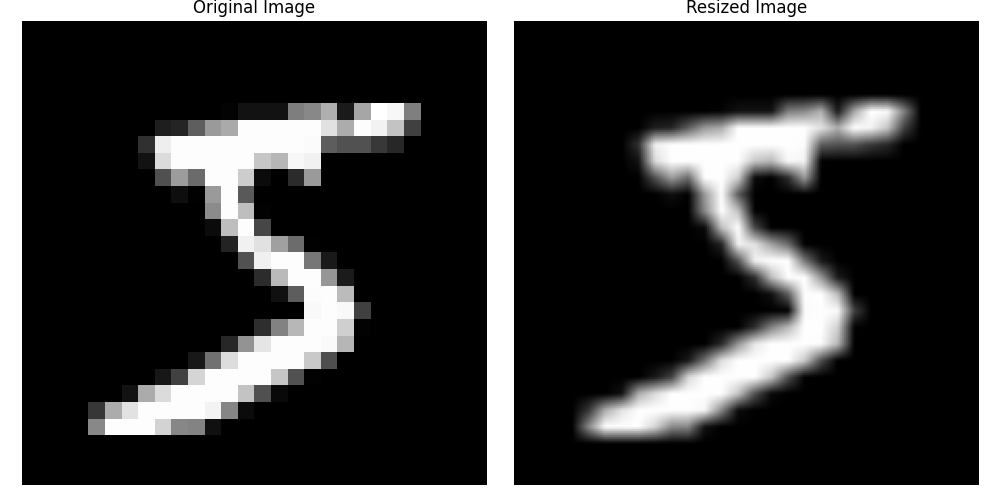
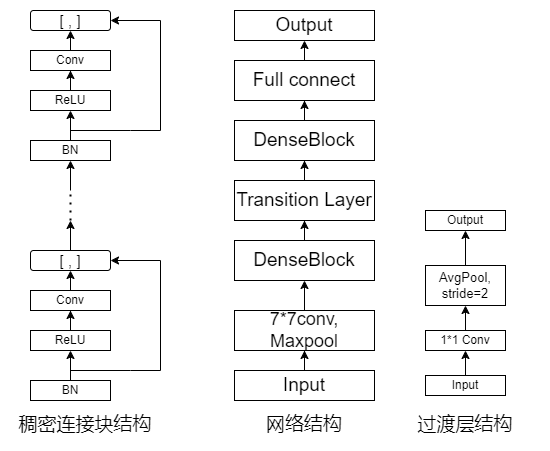
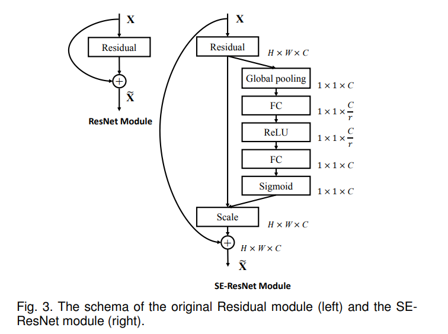
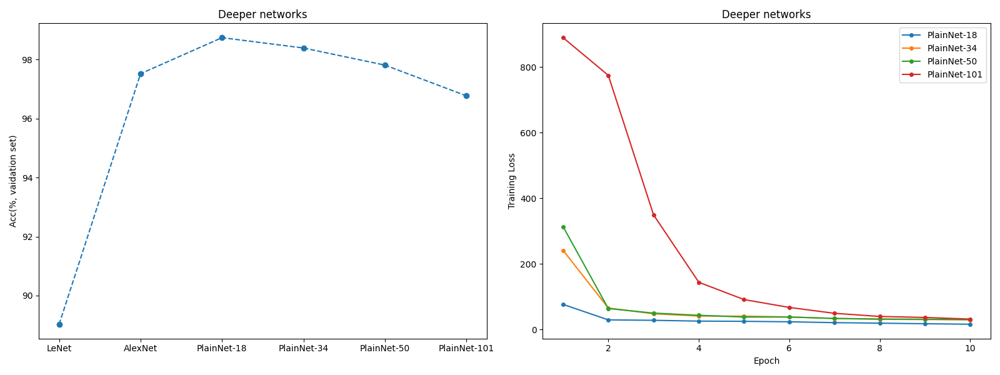
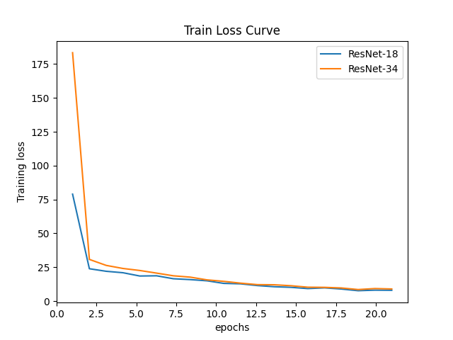
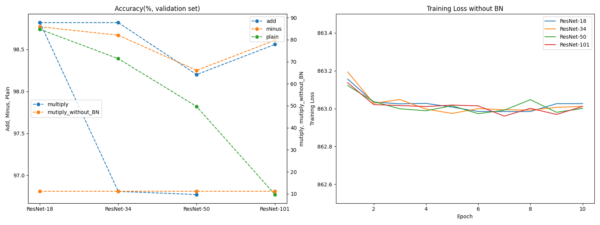
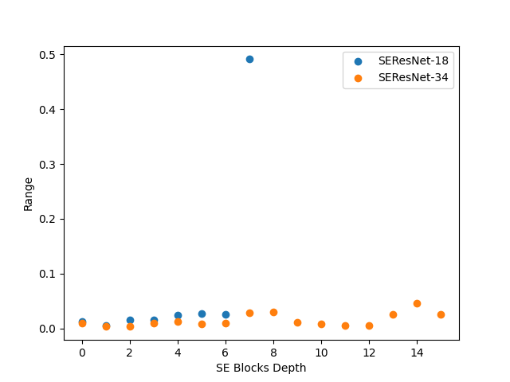

## 概述

要运行代码，只需要运行下面的命令

```
cd src
python main.py --model <model_name> [options]

Options:
 --lr <learing_rate>          learning rate
 --epochs <epochs>            training epochs(10 default)
 --residual <method_name>     residual connection method(add default)
 --gr <growth_rate>           growth rate (in DenseNet)
 --ratio <ratio>              ratio (in SENet)
 --test                       use test dataset (not validation dataset)
 
 e.g.
 python main.py --model ResNet18 --test
```

在实验中，我实现的模型包括

- 卷积神经网络LeNet^[1]^
- 深层卷积神经网络AlexNet^[2]^
- 残差连接网络ResNet^[3]^，包括ResNet18, ResNet34, ResNet50, ResNet101
- 稠密连接网络DenseNet^[4]^
- 通道上的注意力机制Squeeze-and-Excitation Networks^[5]^，包括在残差块上改进的SEResNet18, SEResNet34和在AlexNet上添加注意力机制的SEAlexNet

## 实验过程

### 问题：MNIST数据集与网络原始结构并不匹配

我们知道，AlexNet, ResNet以及之后的大部分网络都是基于ImageNet数据集设计的，与实验所用的MNIST数据集存在下面几个主要的区别：

- 图片的类别种类不同，ImageNet为1000，MNIST为10，这会影响作为分类器的全连接层的输出维度
- 图片的分辨率不同，MINST数据集的每张图片的大小为22 * 22， 而在近年来的工作中，我们往往采用224 * 224的图片分辨率作为训练与评价模型所用的数据集。

为了解决上面的区别，我采用了下面的方式：

- 在论文中的网络之后添加一个全连接层，输出10分类的结果

  ```
  self.adaptor = nn.Sequential(
              nn.Linear(1000, 10),
              nn.Softmax(dim = 1)
          )
  ```

- 在训练网络前，我们对MNIST数据进行下面的预处理

  ```
  transform_others = transforms.Compose([
      transforms.Resize((224, 224)),  # 调整图像尺寸为AlexNet等其它网络所需的224x224
      transforms.Grayscale(num_output_channels=3),  # 调整通道数以适合网络结构
      transforms.ToTensor(),
      transforms.Normalize((0.5, 0.5, 0.5), (0.5, 0.5, 0.5)),
  ])
  ```

  其中，我们使用`transforms.Resize()`，该方法通过双线性插值法来调整图片大小（分辨率），下面我们给出了插值前后的图片对比

  

事实上，调整图片大小也是常见的**数据增强**的手段之一，因此我们这里的resize操作也是合理的。

### 实现模型简介

LeNet, AlexNet, ResNet三种网络结构在课堂上已经介绍过，同时也是必须实现的三种网络，因此我的实现并没有什么特殊之处，具体实现可以参考下面的源代码：LeNet: `src/models/LeNet`, AlexNet: `src/models/LeNet`,ResNet: `src/models/ResNet, src/models/ResNet50`，对于非要求的网络，我实现了DenseNet与SENet，下面我会简要介绍两种模型的内容与实现

#### DenseNet

DenseNet的思想与ResNet类似，都是在非线性输出的基础上保留输入特征的信息，而与ResNet通过残差连接的方式不同，DenNet将输入与非线性输出在通道维度上进行连接。然而这会使得特征$x$的通道维度迅速增加，因此需要通过过渡层来减小通道数与图片高和宽。



从上面的结构图中，我们可以看到稠密连接块中会通过多个连接操作增加通道维度，而过渡层通过1*1卷积来在减少通道，同时通过步长为2的池化层来减半高和宽。

#### SE-Net



SE-Net的基本思想是，对通道间的关系进行学习，为每个通道赋予不同的权重，从而将重要通道的特征强化，非重要通道的特征弱化，实现性能的提升，具体地：

- 通过全局池化综合每个通道的信息
- 通过两个全连接层学习通道信息与特征的关系
- Sigmoid激活函数将全连接层的输出变化到0-1之间，作为scaler与学习后的特征相乘

### Debug过程与方法

在编写机器学习/深度学习相关的代码中，最常见的异常就是矩阵/向量运算的维度错误，为了保证我们实现的模型在运算上的正确性，我们可以查看神经网络中每一层的输出维度，并与我们设计网络时预先设计好的维度进行对比，找到可能出现问题的代码位置，例如

```
input_lenet_sz = (1, 1, 28, 28)
summary(LeNet(), input_size=input_lenet_sz, device="cpu")

==========================================================================================
Layer (type:depth-idx)                   Output Shape              Param #
==========================================================================================
LeNet                                    [1, 10]                   --
├─Sequential: 1-1                        [1, 10]                   --
│    └─Conv2d: 2-1                       [1, 6, 28, 28]            156
│    └─Sigmoid: 2-2                      [1, 6, 28, 28]            --
│    └─AvgPool2d: 2-3                    [1, 6, 14, 14]            --
│    └─Conv2d: 2-4                       [1, 16, 10, 10]           2,416
│    └─Sigmoid: 2-5                      [1, 16, 10, 10]           --
│    └─AvgPool2d: 2-6                    [1, 16, 5, 5]             --
│    └─Flatten: 2-7                      [1, 400]                  --
│    └─Linear: 2-8                       [1, 120]                  48,120
│    └─Sigmoid: 2-9                      [1, 120]                  --
│    └─Linear: 2-10                      [1, 84]                   10,164
│    └─Sigmoid: 2-11                     [1, 84]                   --
│    └─Linear: 2-12                      [1, 10]                   850
==========================================================================================
Total params: 61,706
Trainable params: 61,706
Non-trainable params: 0
Total mult-adds (M): 0.42
```


## 实验结果

| Name        | Params      | MACs   | Accuracy (%) |
| ----------- | ----------- | ------ | ------------ |
| LeNet       | 61,706      | 0.42M  | 90.29        |
| AlexNet     | 50,854,018  | 4.04G  | 97.50        |
| ResNet-18   | 11,702,530  | 7.20G  | 98.75        |
| ResNet-34   | 21,814,402  | 14.57G | <u>98.85</u> |
| ResNet-50   | 57,390,658  | 36.38G | 98.81        |
| ResNet-101  | 115,428,930 | 81.83G | 98.38        |
| DenseNet    | 359,490     | 1.34G  | <u>98.85</u> |
| SE-ResNet18 | 12,401,730  | 7.20G  | **99.13**    |
| SE-ResNet34 | 23,077,538  | 14.58G | <u>98.88</u> |

我统计了部分模型在测试集上的预测准确率，以及模型的大小（参数量）与乘加运算数量，前者决定了模型占用内存/显存的大小，后者则影响了模型训练时的运算量。

## 结果分析

总的来说，添加注意力机制的SEResNet取得了最好的预测效果，而ResNet和DenseNet系列的准确率也解决SEResNet，AlexNet作为初代深度网络，准确率较低，而LeNet作为早期的探索工作，同时也是最简单的模型，自然性能表现也是最差的。

### 网络深度的影响



从实验结果中，我们发现，与LeNet相比，具有更深网络结果的其它网络都有着性能上的显著提高，而随着网络的层数增加，网络的性能逐渐降低。这一现象似乎与我们的预期一致，即简单堆砌网络会使得网络的性能下降。但考虑到MNIST数据集与我们使用的网络结构相比过于简单，这一现象也可能是模型**过拟合**导致的。于是我们也研究了模型训练时的Training Loss，我们发现，随着网络深度的增加，Training Loss 并没有继续下降，这与过拟合问题低 Training Loss 高 Test Loss的现象**不符**，因此我们可以认为深层网络的性能下降是层数增加导致的，而非模型的过拟合。

### 残差连接

在不含残差连接的PlainNet上，我们发现了网络层数增加导致的模型性能的下降，现在我们用类似的方法来研究添加残差连接后的准确率与Training Loss的情况，为了保证网络收敛，我们持续训练网络直到Training Loss 稳定下来。



由于时间有限，我没有研究更深层网络的训练时行为，但从上图中我们已经可以注意到，添加残差连接使得较深的网络不会产生退化现象。

此外，我还简单研究了将ResNet中的残差连接操作从加法换为其它运算是否会对ResNet的性能产生显著影响，下面在验证集上的实验表明：

- 用减法运算替代加法进行残差连接对性能的影响不大，这符合我们的预期，因为神经网络可以通过参数的学习来适应模型的这一变化

- 采用乘法运算会使得模型的性能迅速降低，我认为这是因为乘法运算会加剧反向传播过程中参数梯度的爆炸/消失。为了详细说明这一点，我们考虑下面几种模型
  $$
  无连接: y = ReLU(h(x))\\
  残差连接:y = ReLU(h(x) + x) \\
  减法连接:y = ReLU(h(x) - x)\\
  乘法连接:y = ReLU(h(x) \times x)\\
  $$
  其中$h(x)$我们认为是多层网络，我们想要优化的参数$\theta$位于该层的上一层，即$x = x(\theta)$，我们可以知道，$\nabla h(x)$往往很小，同时为了方便讨论，我们假设所有ReLU激活函数都输入都不是0，并且我们采用简单的损失函数$\mathcal L = (y - y_0)$，使用梯度优化参数$\hat \theta^\prime = \hat \theta - \epsilon \nabla_\theta \mathcal L = \hat \theta - \epsilon \nabla_\theta \mathcal y$，我们分别计算几种模型的梯度
  $$
  无连接: \nabla_\theta \mathcal y = \nabla_\theta x^T \nabla_x h\\
  残差连接:\nabla_\theta \mathcal y = \nabla_\theta x^T (\nabla_x h + \bold 1)\\
  减法连接:\nabla_\theta \mathcal y = \nabla_\theta x^T (\nabla_x h - \bold 1)\\
  乘法连接:\nabla_\theta \mathcal y = \nabla_\theta x^T (h(x) + \nabla_x h \cdot x)\\
  $$
  我们可以知道，残差连接由于有常数1的存在，可以保证梯度不会过大或过小，而普通的网络则会受到$\nabla h(x)$的影响，导致梯度的爆炸或消失问题。使用Batch Normalization 技术可以帮助我们稳定梯度$\nabla_x h$，改进无连接网络的性能，但BN之后的特征$x$往往是小于1的，因此对于深层网络，我们可以想象乘法连接下的梯度仍然会迅速的趋近为0，产生类似梯度消失的问题，BN层甚至会加剧这一问题，在训练时产生loss 为NaN的情况，导致网络无法训练。而去除BN层之后的乘法连接网络会导致Loss下降缓慢，难以收敛，这也与梯度消失的现象保持一致。

  

  

### 稠密连接

在所有的模型中，DenseNet通过较小的参数量与计算量就取得了优秀的性能表现，文献^[6]^认为这是由于网络采用了skip-connection有效传递了信息的原因。

### 通道注意力

我们之前提到了，SENet的改进在于对通道关系的学习，我们希望网络能够为重要的通道赋予更高的权重。直接观测网络对通道的权重标定是很困难的，但我们可以通过观察训练好的网络给出的通道重要性向量来判断权重机制是否生效。在大多数情况下，我们希望训练好的网络尽可能为不同通道赋予不同的权重，而不是给予一样的权重（此时我们的网络就退化为普通的ResNet了）。

于是我检查了训练好的SEResNet模型中所有SE块的通道权重向量的极差，如果我们的权重各不相同，那么极差应该尽可能的大，从下面的结果可以观测到网络确实给出了有效的权重预测。



另外我们注意到SEResNet-18学习到的权重的极差显著较大，因此它的性能也高于ResNet18，而SEResNet-34的极差较小，因此它的预测性能与ResNet-34接近，这与我们的实验结果一致。

## References

[1] Y. Lecun, L. Bottou, Y. Bengio, and P. Haffner, "Gradient-based learning applied to document recognition," *Proceedings of the IEEE*, vol. 86, no. 11, pp. 2278-2324, 1998. doi: 10.1109/5.726791.

[2] A. Krizhevsky, I. Sutskever, and G. E. Hinton, "Imagenet classification with deep convolutional neural networks," in *Advances in Neural Information Processing Systems*, pp. 1097–1105, 2012.

[3] K. He, X. Zhang, S. Ren, and J. Sun, "Deep residual learning for image recognition," in *Proceedings of the IEEE Conference on Computer Vision and Pattern Recognition*, pp. 770–778, 2016.

[4] G. Huang, Z. Liu, L. Van Der Maaten, and K. Q. Weinberger, "Densely connected convolutional networks," in *Proceedings of the IEEE Conference on Computer Vision and Pattern Recognition*, pp. 4700–4708, 2017.

[5] J. Hu, L. Shen, and G. Sun, "Squeeze-and-excitation networks," in *Proceedings of the IEEE Conference on Computer Vision and Pattern Recognition*, pp. 7132–7141, 2018.

[6] A. Emin Orhan and Xaq Pitkow, "Skip connections eliminate singularities," *arXiv preprint arXiv:1701.09175*, 2017.
